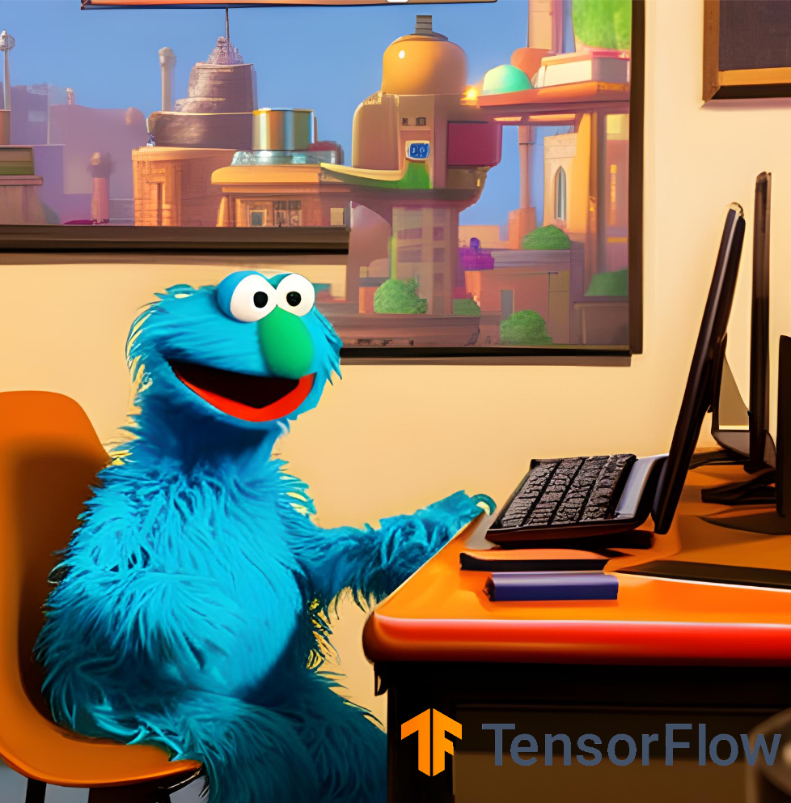
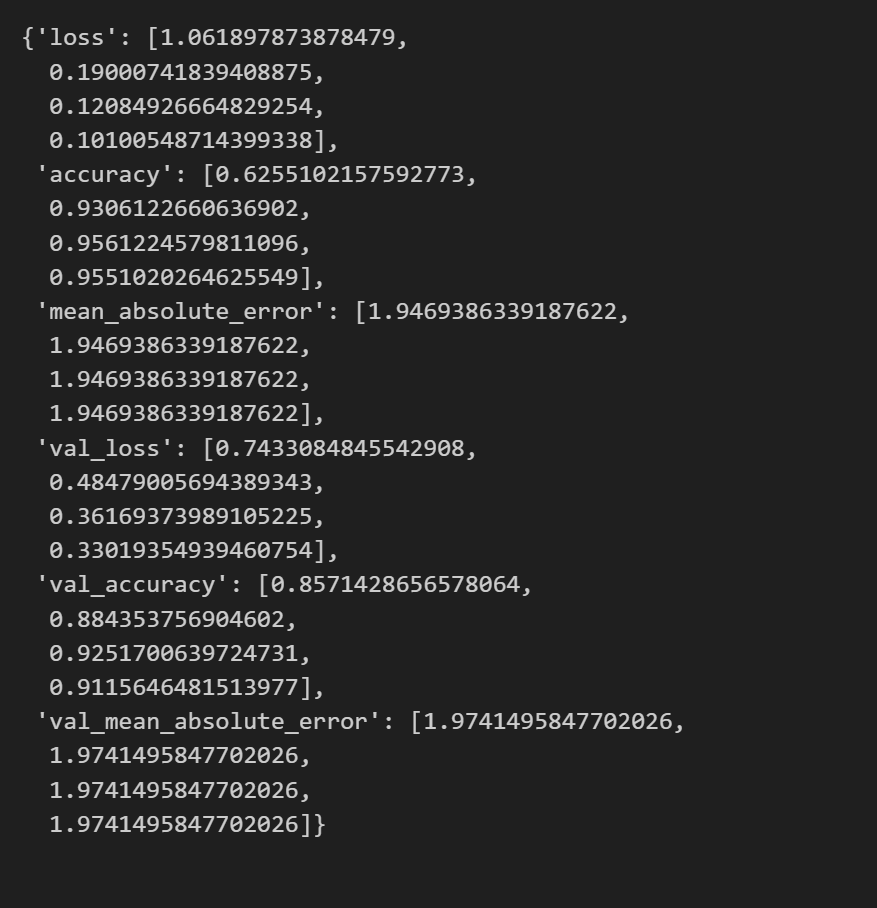
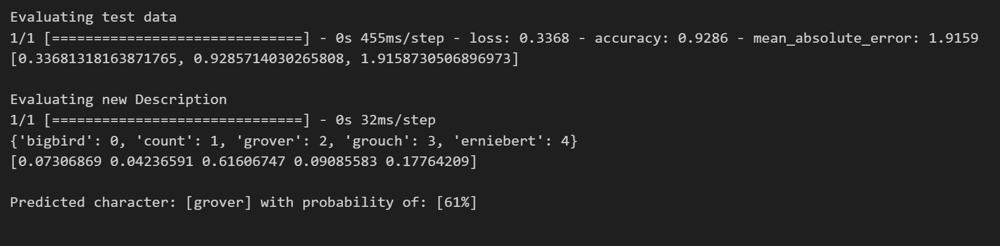

# TensorFlowJS Helps Sesame Street make a Presence on LinkedIn



Got you there! Google's large language model Bard inspired that title. No way a childrens' show would use such a network for their young audience when they can do better.

A continuation of our previous article: [Make Linkedin Fun — with NLP and Sesame Street](https://medium.com/call-for-atlas/make-linkedin-fun-with-nlp-and-sesame-street-6713d95d567a). We built a scikit-learn python model to joyously convert our network into the Sesame Street crowd. But - we were inefficient with the delivery of the model and predictions.

In this article, we will show you how to construct a Python model using Keras and TensorFlow to replicate an Scikit-learn Python model and prepare it for the web. 

# Build it with Tensorflow

To deliver the web experience we want, we need to use TensorFlowJS. TensorFlowJS is a JavaScript library that makes it easy to use TensorFlow buily AI models on the web.

Given that in the previous article we used scikit, we need to reconstruct a similar model in Tensorflow. Our challenge here is to use APIs that are common to both the python and javascript variant of this powerfull AI framework.

Start by installing Tensorflow and its supporting libraries:

`pip install tensorflow tensorflow_addons tensorflow_hub`

We are assuming that you have the same environment from the previous article, which means you also have `string`, and various `nltk` components ready.

## Use USE

In our previous article we used a bag of words (BoW) with individual bi-grams, which was good for a usecase of low words-to-samples ratio. This time, we will use word sequences instead, through the USE pretrained model.

**Universal Sentence Encoder** (USE) is a pretrained model within the tensforflow HUB, that can generate 512 dimensioned embeddings. These embeddings are recommended for short paragraphs, which is what most linkedin titles and descriptions are made of. Unlike our previous attempt with the BoW, this model comes with its own vabulary (which we can train with our datasets' vocabulary).

Let's load up again our corpus of synthetic linkedin titles:

```python
DATA = "./data/anonLinkedInProfiles.csv"
DATA_LEN = 1400
LABEL_DICT = dict()

data = pd.concat([chunk for chunk in tqdm(pd.read_csv(DATA, chunksize=1000), desc=f'Loadin {DATA}')])
print(f'Shape: {data.shape}, does it have NAs:\n{data.isna().any()}')

data = data.sample(DATA_LEN, random_state=200)
data = data.reset_index() # Reset index, since we will do operations on it!
print(f'Resampled Shape: {data.shape}')
data.head()
```

Do the standard cleaning routine of:
1. Drop **STOP** words, whitespaces or symbols (e.g. ['he', 'ah', '!'])
2. **Tokenize** words (e.g. 'today is raining' to ['today', 'raining']).
3. Reduce words to their **lemmas** (e.g. 'raining' reduced to 'rain').
4. Convert labels to ordinals.

Note that we are using the tqdm library for both pandas and dataset processes (in *progress_apply*), to give a visual cue on the progress.

```python
import string
from nltk.corpus import stopwords
from nltk.stem import WordNetLemmatizer
from nltk.corpus import wordnet 
from nltk import pos_tag

def _get_or_set_label(x):
    if x not in LABEL_DICT:
        LABEL_DICT[x] = len(LABEL_DICT)
    return LABEL_DICT[x]

X = data['titles'].astype(str) +  ' ' + data['descriptions'].astype(str)
Y = data['class'].apply(lambda x: _get_or_set_label(x)).astype(int)

WNL = WordNetLemmatizer()
STOP_WORDS = stopwords.words('english')

def clean_sentence(original_text):
  def _get_wordnet_pos(word):
    tag = pos_tag([word])[0][1][0].upper()
    tag_dict = {"J": wordnet.ADJ,
                "N": wordnet.NOUN,
                "V": wordnet.VERB,
                "R": wordnet.ADV}

    return tag_dict.get(tag, wordnet.NOUN)
  
  cleaned_text = original_text.strip()
  cleaned_text = original_text.translate(str.maketrans(' ', ' ', string.punctuation))
  cleaned_text = cleaned_text.translate(str.maketrans(' ', ' ', '\n')) # Remove newlines
  cleaned_text = cleaned_text.translate(str.maketrans(' ', ' ', string.digits)) # Remove digits
  cleaned_text = cleaned_text.lower() # Convert to lowercase
  cleaned_text = cleaned_text.split() # Split each sentence using delimiter

  lemmatized_list=[]
  for y in cleaned_text:
    if y in STOP_WORDS:
      continue
    z=WNL.lemmatize(y, _get_wordnet_pos(y))
    lemmatized_list.append(z)

  lemmatized_sentence = ' '.join(lemmatized_list)
  return lemmatized_sentence

X_cleaned = X.progress_apply(lambda text: clean_sentence(text))
```
Split the dataset into *train*, *validation* and *test*:
```python
import tensorflow as tf
from tensorflow.data import Dataset, AUTOTUNE

def text_to_dataset(texts,labels):
    return Dataset.from_tensor_slices((texts, labels.tolist())).cache().batch(hparams['batch_size']).prefetch(AUTOTUNE)

VAL_SIZE = int(len(X)*0.3)


x_train = X_cleaned[VAL_SIZE:]
y_train = Y[VAL_SIZE:]

x_val = X_cleaned[:VAL_SIZE]
y_val = Y[:VAL_SIZE]

TEST_SIZE = int(len(x_val)*0.3)

x_test = x_val[TEST_SIZE:]
y_test = y_val[TEST_SIZE:]
x_val = x_val[:TEST_SIZE]
y_val = y_val[:TEST_SIZE]

train_ds = text_to_dataset(x_train, y_train)
val_ds = text_to_dataset(x_test, y_test)
test_ds = text_to_dataset(x_val, y_val)

# get top 5 elements of this prefectched slice.
list(train_ds.take(1))[0][1][:5]
```

Now we buid the our first text classifying Neural Network (NN), exciting!


Our NN will have the following layers:

- The input layer for the NN will be the USE model, which it will automatically download from the given URL with tensorflow HUB. The output of this layer is 512DIM word embeddings.
- A hidden layer in the middle will help us reduce dimensionality to 1/2 and uses a sigmoid activation function. The sigmoid is analogous to the linear regression applied in the previous article with Scikit-learn.
- We apply a normalization function after the previous activation, to reduce shifts in our weights with every training epoch.
- Finally, we map the NN's outputs to the 5 classes we set up in the previous article, and output the probability through a softmax activation function.

```python
import tensorflow_hub as hub

USE_URL = "https://tfhub.dev/google/universal-sentence-encoder/4"

model = keras.Sequential(
    [
        hub.KerasLayer(USE_URL,
                    output_shape=[hparams['embedding_dim']], 
                    input_shape=[],     
                    dtype=tf.string,
                    name="in_pretrained",
                    trainable=hparams['embedding_trainable']),
        layers.Dense(int(hparams['embedding_dim']/4), activation="sigmoid", name="layer2"),
        layers.Dropout(hparams['dropout_rate']),
        layers.BatchNormalization(),
        layers.Dense(len(LABEL_DICT), activation="softmax", name="out")
    ]
)

# Load the model and view a summary.
model.compile(
    loss = tf.losses.SparseCategoricalCrossentropy(from_logits=True),
    optimizer=tf.optimizers.Adam(learning_rate=hparams['learning_rate']), 
    metrics = [keras.metrics.SparseCategoricalAccuracy(name="accuracy"),
               keras.metrics.MeanAbsoluteError(name='mean_absolute_error')
            ])

model.summary()
```

Compiling the model give us:


## Fit for the Street

With the model and data prepared, it's time to fit and test our model. We only use 4 epochs, as the dataset is small and after 2 epochs the NN is good enough:

```python
import tensorflow_addons as tfa

tqdm_callback = tfa.callbacks.TQDMProgressBar()

history = model.fit(train_ds, 
                    epochs=4, 
                    verbose = 10,
                    validation_data = val_ds,
                    callbacks=[tqdm_callback]
                    )

history.history
```

Note the use of the TQDM progress bar, there is a lot of utility in that addon. With every epoch you can see the model improving:



We need to test the NN with the prepared test dataset from the previous section, and if good enough we should test it with a never seem LinkedIn description:

```python
from math import floor

print("Evaluating test data")
print(model.evaluate(test_ds, batch_size=hparams['batch_size']))

job_titles = ["IT Consultant at Sesame Street, lord of Java Code, who likes to learn new stuff and tries some machine learning in my free engineering time."]

print("\nEvaluating new Description")
probas = model.predict(job_titles)[0]
print(LABEL_DICT)
print(probas)

max_proba_idx = np.argmax(probas)
print(f'\nPredicted character: [{list(LABEL_DICT)[max_proba_idx]}] with probability of: [{floor(probas[max_proba_idx]*100.0)}%]')
```

Gives us:



This new description is the same one used in the previous article with scikit-learn, the output was Grover at a substantial probability. The output is the same for this NN, therefore we have validated that this will give the same output as the previous model.

# From Python to Javascript

Enough with the snake, let's do some nice webapps.


# Conclusion

We learned how to create an extension and how to use NLP to make our linkedin more fun!

The extension scrapes linked in, but up to a maximum of 5 profiles. Linkedin will ban your account if you abuse the site, so be a good citizen when you do scraping.

## References

- https://tfhub.dev/google/universal-sentence-encoder/4 
- https://js.tensorflow.org/api/latest/
- https://bard.google.com/ 
- https://www.kaggle.com/

## Github

Article here is also available on [Github](https://github.com/adamd1985/AugmentedLinkedInFun)

Kaggle notebook available [here](https://www.kaggle.com/code/addarm/linkedin-profiles-as-sesame-street-characters)


## Media

All media used (in the form of code or images) are either solely owned by me, acquired through licensing, or part of the Public Domain and granted use through Creative Commons License.

All PNGs are either created by me or generated by Canva's text to image generator.

Sesame Street is copywrited and all characters are owned by its company.

## CC Licensing and Use

<a rel="license" href="http://creativecommons.org/licenses/by-nc/4.0/"></a><br />This work is licensed under a <a rel="license" href="http://creativecommons.org/licenses/by-nc/4.0/">Creative Commons Attribution-NonCommercial 4.0 International License</a>.

#

<div align="right">Made with :heartpulse: by <b>Adam</b></div>