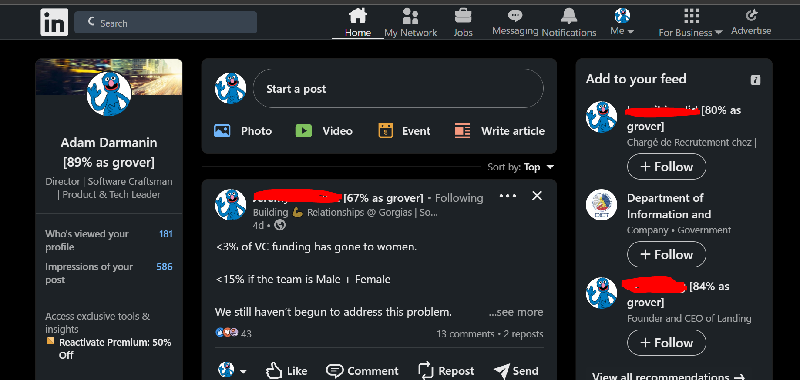

# TensorFlowJS Helps Sesame Street make a Presence on LinkedIn


Got you there! Google's large language model Bard inspired that title. No way a childrens' show would use such a network for their young audience when they can do better.

A continuation of our previous article: [Make Linkedin Fun — with NLP and Sesame Street](./articleImages/https://medium.com/call-for-atlas/make-linkedin-fun-with-nlp-and-sesame-street-6713d95d567a). We built a scikit-learn python model to joyously convert our network into the Sesame Street crowd. But - we were inefficient with the delivery of the model and predictions.

In this article, we will show you how to construct a Python model using Keras and TensorFlow to replicate an Scikit-learn Python model and prepare it for the web. 

# Build it with Tensorflow

To deliver the web experience we want, we need to use TensorFlowJS. TensorFlowJS is a JavaScript library that makes it easy to use TensorFlow buily AI models on the web.

Given that in the previous article we used scikit, we need to reconstruct a similar model in Tensorflow. Our challenge here is to use APIs that are common to both the python and javascript variant of this powerfull AI framework.

Start by installing Tensorflow and its supporting libraries:

`pip install tensorflow tensorflow_addons tensorflow_hub`

We are assuming that you have the same environment from the previous article, which means you also have `string`, and various `nltk` components ready.

## Use USE

In our previous article we used a bag of words (BoW) with individual bi-grams, which was good for a usecase of low words-to-samples ratio. This time, we will use word sequences instead, through the USE pretrained model.

**Universal Sentence Encoder** (USE) is a pretrained model within the tensforflow HUB, that can generate 512 dimensioned embeddings. These embeddings are recommended for short paragraphs, which is what most linkedin titles and descriptions are made of. Unlike our previous attempt with the BoW, this model comes with its own vabulary (which we can train with our datasets' vocabulary).

Let's load up again our corpus of synthetic linkedin titles:

```python
DATA = "./data/anonLinkedInProfiles.csv"
DATA_LEN = 1400
LABEL_DICT = dict()

data = pd.concat([chunk for chunk in tqdm(pd.read_csv(DATA, chunksize=1000), desc=f'Loadin {DATA}')])
print(f'Shape: {data.shape}, does it have NAs:\n{data.isna().any()}')

data = data.sample(DATA_LEN, random_state=200)
data = data.reset_index() # Reset index, since we will do operations on it!
print(f'Resampled Shape: {data.shape}')
data.head()
```

Do the standard cleaning routine of:
1. Drop **STOP** words, whitespaces or symbols (e.g. ['he', 'ah', '!'])
2. **Tokenize** words (e.g. 'today is raining' to ['today', 'raining']).
3. Reduce words to their **lemmas** (e.g. 'raining' reduced to 'rain').
4. Convert labels to ordinals.

Note that we are using the tqdm library for both pandas and dataset processes (in *progress_apply*), to give a visual cue on the progress.

```python
import string
from nltk.corpus import stopwords
from nltk.stem import WordNetLemmatizer
from nltk.corpus import wordnet 
from nltk import pos_tag

def _get_or_set_label(x):
    if x not in LABEL_DICT:
        LABEL_DICT[x] = len(LABEL_DICT)
    return LABEL_DICT[x]

X = data['titles'].astype(str) +  ' ' + data['descriptions'].astype(str)
Y = data['class'].apply(lambda x: _get_or_set_label(x)).astype(int)

WNL = WordNetLemmatizer()
STOP_WORDS = stopwords.words('english')

def clean_sentence(original_text):
  def _get_wordnet_pos(word):
    tag = pos_tag([word])[0][1][0].upper()
    tag_dict = {"J": wordnet.ADJ,
                "N": wordnet.NOUN,
                "V": wordnet.VERB,
                "R": wordnet.ADV}

    return tag_dict.get(tag, wordnet.NOUN)
  
  cleaned_text = original_text.strip()
  cleaned_text = original_text.translate(str.maketrans(' ', ' ', string.punctuation))
  cleaned_text = cleaned_text.translate(str.maketrans(' ', ' ', '\n')) # Remove newlines
  cleaned_text = cleaned_text.translate(str.maketrans(' ', ' ', string.digits)) # Remove digits
  cleaned_text = cleaned_text.lower() # Convert to lowercase
  cleaned_text = cleaned_text.split() # Split each sentence using delimiter

  lemmatized_list=[]
  for y in cleaned_text:
    if y in STOP_WORDS:
      continue
    z=WNL.lemmatize(y, _get_wordnet_pos(y))
    lemmatized_list.append(z)

  lemmatized_sentence = ' '.join(lemmatized_list)
  return lemmatized_sentence

X_cleaned = X.progress_apply(lambda text: clean_sentence(text))
```

Split the dataset into *train*, *validation* and *test* while converting text to embeddings:

```python
import tensorflow as tf
from tensorflow.data import Dataset, AUTOTUNE
import tensorflow_hub as hub

EMBED = hub.load("https://tfhub.dev/google/universal-sentence-encoder/4")

def text_to_dataset(texts,labels):
    return Dataset.from_tensor_slices((EMBED(texts), labels.tolist())).cache().batch(hparams['batch_size'],drop_remainder=True).prefetch(AUTOTUNE)

VAL_SIZE = int(len(X)*0.3)


x_train = X_cleaned[VAL_SIZE:]
y_train = Y[VAL_SIZE:]

x_val = X_cleaned[:VAL_SIZE]
y_val = Y[:VAL_SIZE]

TEST_SIZE = int(len(x_val)*0.3)

x_test = x_val[TEST_SIZE:]
y_test = y_val[TEST_SIZE:]
x_val = x_val[:TEST_SIZE]
y_val = y_val[:TEST_SIZE]

print(f'Sizes for TEST: {TEST_SIZE}, validation: {VAL_SIZE} and train: {len(X) - VAL_SIZE}')

train_ds = text_to_dataset(x_train, y_train)
val_ds = text_to_dataset(x_test, y_test)
test_ds = text_to_dataset(x_val, y_val)

list(test_ds.take(1))[0]
```

Now we buid the our first text classifying Neural Network (NN), exciting!


Our NN will have the following layers:

- The input layer for the NN will be the USE model embeddings previously generated. The input shape of this layer is 512DIM word embeddings and the batchsize configured.
- A hidden layer in the middle will help us reduce dimensionality to 1/2 and uses a sigmoid activation function. The sigmoid is analogous to the linear regression applied in the previous article with Scikit-learn.
- We apply a normalization function after the previous activation, to reduce shifts in our weights with every training epoch.
- Finally, we map the NN's outputs to the 5 classes we set up in the previous article, and output the probability through a softmax activation function.

```python
model = keras.Sequential(
    [
        layers.InputLayer(input_shape=(512,),batch_size=hparams['batch_size'], name="in_embeddings"),
        layers.Dense(int(hparams['embedding_dim']/4),batch_size=hparams['batch_size'], activation="sigmoid", name="layer1"),
        layers.Dropout(hparams['dropout_rate'],batch_size=hparams['batch_size'], name="drop"),
        layers.BatchNormalization(batch_size=hparams['batch_size']),
        layers.Dense(len(LABEL_DICT),batch_size=hparams['batch_size'], activation="softmax", name="out")
    ]
)

# Load the model and view a summary.
model.compile(
    loss = tf.losses.SparseCategoricalCrossentropy(from_logits=True),
    optimizer=tf.optimizers.Adam(learning_rate=hparams['learning_rate']), 
    metrics = [keras.metrics.SparseCategoricalAccuracy(name="accuracy"),
               keras.metrics.MeanAbsoluteError(name='mean_absolute_error')
            ])

model.summary()
```

Tensorflow is comprised of these such building blocks, and once you get comfortable with them, you have no end to the AI functionality you can create.

Compiling the model give us this:


## Fit for the Street

With the model and data prepared, it's time to fit and test our model. We only use 4 epochs, as the dataset is small and after 2 epochs the NN is good enough:

```python
import tensorflow_addons as tfa

tqdm_callback = tfa.callbacks.TQDMProgressBar()

history = model.fit(train_ds, 
                    epochs=10, 
                    verbose = 10,
                    validation_data = val_ds,
                    callbacks=[tqdm_callback]
                    )

history.history
```

Note the use of the TQDM progress bar, there is a lot of utility in that addon. With every epoch you can see the model improving:


We need to test the NN with the prepared test dataset from the previous section, and if good enough we should test it with a never seem LinkedIn description:

```python
from math import floor

print("Evaluating test data")
print(model.evaluate(test_ds, batch_size=hparams['batch_size']))

# Remember all our imputs need to be embedded first!
job_titles = EMBED(["IT Consultant at Sesame Street, lord of Java Code, who likes to learn new stuff and tries some machine learning in my free engineering time."])

print("\nEvaluating new Description")
probas = model.predict(job_titles)[0]
print(LABEL_DICT)
print(probas)

max_proba_idx = np.argmax(probas)
print(f'\nPredicted character: [{list(LABEL_DICT)[max_proba_idx]}] with probability of: [{floor(probas[max_proba_idx]*100.0)}%]')
```

Gives us:


This new description is the same one used in the previous article with scikit-learn, the output was Grover at a substantial probability. The output is the same for this NN, therefore we have validated that this will give the same output as the previous model.

With everything validated, let's save the model in the full tensorflow format, and reload it to validate it works:
```python
MODEL_PATH = 'models/tf'

model.save(MODEL_PATH)

model = keras.models.load_model(MODEL_PATH)
model.predict(job_titles)
```

You'll have to install some dependencies, namely: `pip install pyyaml h5py` to allow tensorflow to save the model or raw weights.

# From Python to Javascript

Enough with the snake, let's do some webapps.

Install the required packages for the convertor:
`pip install tensorflowjs[convertor]`

Run the convertion script (remember the paths from the save in the previous section):
```bash
tensorflowjs_converter \
    --input_format=tf_saved_model \
    models/tf \
    models/tfjs
```

To understand some of the details, let's go in depth of what is happening:
- Calling `model.save()` persists our model in a **SavedModel** format. 
- In the saved **1GB** directory, there will be the: trained params, protobuff binaries, and checkpoint model saves. 
- You don't need to rebuild and retrain the model, a `tf.keras.models.load_model()` will serve it fully functional again. We won't reload it in python though.
- `tensorflowjs_converter` or its equivalent APIs will prepare the python binary for JS. `input_format=tf_saved_model` tells it that our original model was in a **SavedModel** format, the output of this convertor will be the same.
- The convertor creates a JSON descriptor of the model, and saves the wieght in a .BIN format - Both have to **exist in the same folder** for the model to be correctly loaded.
- Because of its format, in JS we need to call the API `loadGraphModel()` to load the model.
- The JS model variant will be 272KB, the graph optimized by the converter to be as small as possible for devices and web.

Using nodejs, let's test the model convertion by loading it and running a prediction. 
Install the required modules: `npm install @tensorflow/tfjs @tensorflow/tfjs-node @tensorflow-models/universal-sentence-encoder`

Your package.json should be similar to this:
```json
{
  "dependencies": {
    "@tensorflow-models/universal-sentence-encoder": "^1.3.3",
    "@tensorflow/tfjs": "^4.5.0",
    "@tensorflow/tfjs-node": "^4.5.0",
    "jquery": "^3.6.4",
    "jsdom": "^21.1.1",
    "xpath": "^0.0.32"
  }
}
```

In a javascript test file, we load the USE model to create embeddings (this will be the java variant of the model) and test the same linkedin title from the python notebook:

```javascript
const tf = require("@tensorflow/tfjs");
const tfn = require("@tensorflow/tfjs-node");
const use = require('@tensorflow-models/universal-sentence-encoder');

const handler = tfn.io.fileSystem('./notebooks/models/tfjs/model.json');

async function testModel(){
    const model = await tf.loadLayersModel(handler);

    const useModel = await use.load();
    const embeddings = await useModel.embed(["IT Consultant at Sesame Street, lord of Java Code, who likes to learn new stuff and tries some machine learning in my free engineering time."])

    const t = await model.predict(embeddings);

    // {'bigbird': 0, 'count': 1, 'grover': 2, 'grouch': 3, 'erniebert': 4}
    // [0.00236707 0.00669724 0.9246539  0.06278326 0.00349861]
    console.log(`Prediction from JS vs PY: \nJS - ${t.dataSync()}\nPY - 0.00236707, 0.00669724, 0.9246539, 0.06278326, 0.00349861`);
}

testModel();
```

Which when run with node, will print the following:


The probabilities might not be precisely the same, but the correct class was selected. Not bad! Count Von Count will be satisfied with these numbers.


## Extending the Extension

The model needs to be plugged within the extensions background script. We will be building on the chrome extension done in the previous article.

There will be many changes from the previous article's code, as we have changed the way we import our libraries. Previously it was through minified JS files imported via the `manifest.json`. Now it's a module setup, packaged by the build tool **Parcel**.

Since Parcel will be minifying our JS, it's best to include the map files to allow us to debug the code. Note the **'type'** change to **module**:
```json
"web_accessible_resources": [
        {
            "resources": [
                "assets/bigbird.png",
                "assets/count.png",
                "assets/erniebert.png",
                "assets/grouch.png",
                "assets/grover.png",
                "assets/model.json",
                "scripts/content.js.map",
                "scripts/service_worker.js.map"
            ],
            "matches": [
                "*://www.linkedin.com/*"
            ],
            "use_dynamic_url": true
        }
    ],
    "background": {
        "service_worker": "scripts/service_worker.js",
        "type": "module"
    },
```

We add a class to load, warm up and run the models in our service worker:

```javascript
import * as use from '@tensorflow-models/universal-sentence-encoder';
import * as tf from '@tensorflow/tfjs';
import * as tfc from '@tensorflow/tfjs-converter'

...

/**
 * Async loads a USE and our Custom models on construction.  
 * 
 * Classifies a linkedin profile to the content.js to manipulate the DOM.
 */
class ProfileClassifier {
    /**
     * Constructor.
     * @param {*} savedClassifier The classifier to load from. Can be url string or the json file.
     */
    constructor(savedClassifier = null) {
        this.savedClassifier = savedClassifier;
    }

    /**
     * Loads USE and custom Models, warms the models up.
     */
    async loadModel() {
        console.log('Loading models...');
        if (!this.savedClassifier) {
            console.error('No model.json to load from!');
            throw new Error("No model.json to load from!")
        }
        try {
            // Chrome will have a different path setup for extensions.
            console.log(`Loading USE model...`)
            this.useModel = await use.load();

            console.log(`Loading custom model...`)
            this.model = await tfc.loadGraphModel(this.savedClassifier);

            // Warms up the models by causing intermediate tensor values to be built.
            const startTime = performance.now();
            tf.tidy(() => {
                const embeddings = await this.useModel.embed(["Test descriptions"])
                const result = await this.model.predict(embeddings);

                console.log(`Model loaded with ${result}.`);
            });
            const totalTime = Math.floor(performance.now() - startTime);
            console.log(`Models initialized in ${totalTime} ms...`);
        } catch (e) {
            console.error('Unable to load models', e);
        }
    }

    ...
}
```

Tensorflow's tidy() API provides memory management to avoid the risk of leaks in the browser. This is optional, but if you are to use this API, **you cannot have unresolved Promises** within its closure. This initialization will happen on the extension's load, warming the model by having it cache weights and other layer artefacts on a test prediction.

Within the class, we also need an API to predict:

```javascript
class ProfileClassifier {
    ...

    /**
     * Triggers our models to make a prediction.
     * @param {descriptions} string Profile title and descriptions.
     * @param {sendResponse} function messaging callback to reply to the content script.
     */
    async classifyProfile(descriptions, sendResponse) {
        if (!descriptions) {
            console.error('No descriptions.  No prediction.');
            return;
        }
        if (!this.model || !this.useModel) {
            console.log('Waiting for models to load...');
            setTimeout(
                () => { this.classifyProfile(descriptions, sendResponse) }, 2000);
            return;
        }
        console.log(`Predicting for ${descriptions}`);
        const startTime = performance.now();

        const predictions = tf.tidy(() => {
            const embeddings = await this.useModel.embed([descriptions]);
            console.log(`embeddings: ${embeddings}`);
            const t = await this.model.predict(embeddings);
            return t.dataSync();
        });
        
        console.log(`predictions: ${predictions}`);

        const totalTime = performance.now() - startTime;
        console.log(`Done in ${totalTime.toFixed(1)} ms `);

        const LABELS = ["bigbird", "count", "grover", "grouch", "erniebert"];
        const idx = predictions.reduce((iMax, x, i, arr) => x > arr[iMax] ? i : iMax, 0);

        sendResponse({ 'proba': Math.floor(predictions[idx] * 100), 'label': (LABELS[idx] ?? "N/A") });
    }

    ...
}
```

Let's add this to our handler function in the service worker:
```javascript
// Global variables.
const PROFILE_CLASSIFIER = new ProfileClassifier("https://raw.githubusercontent.com/adamd1985/AugmentedLinkedInFun/master/notebooks/models/tfjs/model.json");
const PROFILE_SCRAPPER = new ProfileScrapper();
PROFILE_CLASSIFIER.loadModel();

...

/**
 * Message handler.
 * If we return TRUE, we are informing chrome that the result of the call will happen asynch.
 */
chrome.runtime.onMessage.addListener((message, sender, sendResponse) => {
    if (!PROFILE_SCRAPPER || !PROFILE_CLASSIFIER) {
        throw new Error("Classes are null!");
    }

    console.log(`Message from ${sender}: ${JSON.stringify(message)}`)
    if (message?.link) {
        PROFILE_SCRAPPER.scrapeProfile(message.link, sendResponse);
    }
    else if (message?.descriptions) {
        PROFILE_CLASSIFIER.classifyProfile(message.descriptions, sendResponse);
    }
    else {
        console.warn(`An unknown message ${message} was received.`);
        return false;
    }
    return true;
});

```

The **content.js** script injected in our linkedin feed also needs an update to call these predictions:
```javascript
/**
   * Augment the linkedin experience by adding info or visual cues.
   * All will happen async as they  call our classification server.
   * @param {*} profiles 
   */
  async augmentLinkedInExperience(profiles) {
    async function _augmentText(element, profile, data) {
      if ($(element).data("scanned")) {
        return;
      }

      let search = `^${profile.user}$`;
      let re = new RegExp(search, "g");

      $(element).data("scanned", true);
      let text = $(element).text().trim();
      if (text.match(re)) {
        if (data['proba'] && data['proba'] >= 0) {
          $(element).text(`${text} [${data['proba']}% as ${data['label']}]`);
        }
      }
    }

    async function _augmentImage(element, profile, data) {
      // TODO: Inefficient, will load all images for each profile.
      // Use tokens to discern if this image is related to the profile.
      if ($(element).attr('ghost-person')) {
        return;
      }
      let name = $(element).attr('alt')
      if (!name) {
        return;
      }
      name = name.trim().toLocaleLowerCase();
      if (!name.includes("photo") && !name.includes("profile") && !name.includes(profile.user.toLocaleLowerCase())) {
        return;
      }
      const tokens = profile.user.toLocaleLowerCase().split(" ");
      for (const tok of tokens) {
        if (name.includes(tok)) {
          const imgUrl = await chrome.runtime.getURL(`assets/${data['label']}.png`)
          $(element).attr('href', imgUrl);
          $(element).attr('src', imgUrl);
          break;
        }
      }
    }

    async function _augmenGhostImage(element, profile, data, image) {
      try {
        const url = await chrome.runtime.getURL(`assets/${data['label']}.png`)

        $(element).empty();
        if (image) {
          let name = $(element).attr('alt')
          if (!name) {
            return;
          }
          name = name.trim().toLocaleLowerCase();
          if (!name.includes("photo") && !name.includes("profile") && !name.includes(profile.user.toLocaleLowerCase())) {
            return;
          }
          const tokens = profile.user.toLocaleLowerCase().split(" ");
          for (const tok of tokens) {
            if (name.includes(tok)) {
              $(element).attr('src', url);
              $(element).attr('href', url);
              break;
            }
          }
        }
        else {
          let found = $(`div:contains("${profile.user}")`, element).first();
          if (found) {
            const img = ``;
            $(element).html(img);
          }
        }
      }
      catch (e) {
        console.error(e);
      }
    }

    console.log(`Processing these profiles: ${profiles}`)
    let promises = [];
    profiles.forEach(function (profile) {
      if (!profile)
        return

      const profiledata = {
        'descriptions': (profile.posts?.join(' ') ?? ' ') + profile.titles,
      };
      console.log(`Predicting for ${profile}`);
      promises.push(
        chrome.runtime.sendMessage(profiledata)
          .then((data) => {
            console.log(`For ${profile.user}: Label: ${data['label']} Proba: ${data['proba']}`);

            $(`div.ivm-view-attr__ghost-entity`).each(async (index, element) => {
              _augmenGhostImage(element, profile, data, false);
            });
            $(`img.ghost-person`).each(async (index, element) => {
              _augmenGhostImage(element, profile, data, true);
            });
            $(`img`).each(async (index, element) => {
              _augmentImage(element, profile, data)
            });
            $(`h1.text-heading-xlarge:contains("${profile.user}")`).each((index, element) => {
              _augmentText(element, profile, data);
            });
            $(`div:contains("${profile.user}")`).each((index, element) => {
              _augmentText(element, profile, data);
            });
            $(`span:contains("${profile.user}")`).each((index, element) => {
              _augmentText(element, profile, data);
            });
            $(`a:contains("${profile.user}")`).each((index, element) => {
              _augmentText(element, profile, data);
            });
          }).catch((error) => {
            console.log('Error: ', error);
          })
      );
    });
  }
```

Once we have all profile data scraped, we call the api above, which sends a message to the background service worker to do the predictions - without affecting the experience of using the website itself (everything should be asynch and failure-proof).

If everything is done right, we will get this:




# Conclusion

We incremented our code and knowledge from the last article: [Make Linkedin Fun — with NLP and Sesame Street](./articleImages/https://medium.com/call-for-atlas/make-linkedin-fun-with-nlp-and-sesame-street-6713d95d567a) by learning how to use tensorflow, and its device/web APIs tensorflowJS.

Unlike our scikit-learn model, with tensorflow we built a lightwieght neural-network to emulate the linear regression model in the previous article. The models, which are usually quite sizable and only run in an external server, can now be served in the web at a smalled size of KBs not GBs!

Finally, here is an artistic interpretation of bigbird learning tensorflow to end your lesson:


## References

- https://tfhub.dev/google/universal-sentence-encoder/4 
- https://js.tensorflow.org/api/latest/
- https://bard.google.com/ 
- https://www.kaggle.com/
- https://www.tensorflow.org/js/guide/conversiontensorflowjs_converter 
- https://www.npmjs.com/package/@tensorflow/tfjs-converter 
- https://parceljs.org/

## Github

Article here is also available on [Github](https://github.com/adamd1985/AugmentedLinkedInFun)

Kaggle notebook available [here](https://www.kaggle.com/code/addarm/linkedin-profiles-as-sesame-street-characters)


## Media

All media used (in the form of code or images) are either solely owned by me, acquired through licensing, or part of the Public Domain and granted use through Creative Commons License.

All PNGs are either created by me or generated by Canva's text to image generator.

Sesame Street is copywrited and all characters are owned by its company.

## CC Licensing and Use

<a rel="license" href="http://creativecommons.org/licenses/by-nc/4.0/"></a><br />This work is licensed under a <a rel="license" href="http://creativecommons.org/licenses/by-nc/4.0/">Creative Commons Attribution-NonCommercial 4.0 International License</a>.

#

<div align="right">Made with :heartpulse: by <b>Adam</b></div>